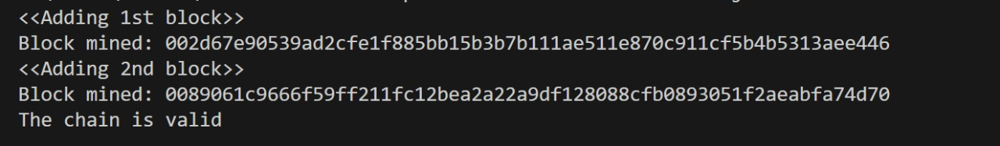

# Blockchain 

## Overview
This repository contains two JavaScript implementations of a blockchain:

1. **Basic Blockchain** (`blockchain.js`): A simple blockchain storing transaction data, timestamps, and cryptographic hashes for validation.

2. **Blockchain with Proof-of-Work** (`blockchain-with-nonce.js`): Introduces a nonce for mining blocks through a cryptographic challenge, enhancing security against manipulation.

## Code Overview
- **Basic Blockchain**:
  - **Block Class**: Represents a single block in the blockchain, containing properties like `index`, `timestamp`, `data`, `previousHash`, and `hash`.
  - **Blockchain Class**: Manages the chain, including methods to create the genesis block, add new blocks, and validate the chain.

- **Blockchain with Proof-of-Work**:
  - Builds upon the basic blockchain, adding a nonce and a mining mechanism that requires solving a cryptographic puzzle (finding a hash with a specific number of leading zeros) to add new blocks.

## Key Features
- **SHA-256 Hashing**: Utilizes cryptographic hashing for block data security.
- **Proof of Work**: Implements a mining algorithm with a difficulty target.
- **Chain Validation**: Validates the integrity of the blockchain.
- **Customizable Blocks**: Each block can hold different data along with a timestamp.

## Technologies
- **Node.js**: Runtime environment for executing the blockchain code.
- **Crypto-JS**: JavaScript library for implementing SHA-256 hashing.

## How to Use
1. Clone the repository.
2. Install dependencies using `npm install`.
3. Run the scripts to simulate blockchain creation and mining.

## Output Screenshot (of blockchain-with-nonce.js)

## License
This project is licensed under the MIT License. See the LICENSE file for more details.

## Author
[Rinitha Rajendran]
